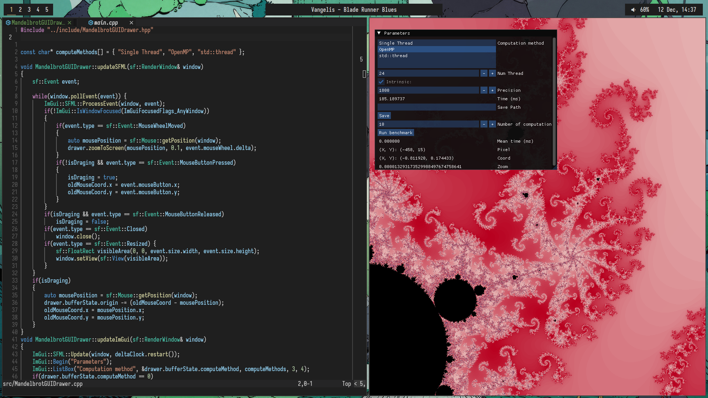

# Config files



* Operating System: [Arch Linux](https://archlinux.org/)
* Windows Manager: [bspwm](https://github.com/baskerville/bspwm) with [sxhkd](https://github.com/baskerville/sxhkd)
* Terminal: [alacritty](https://github.com/alacritty/alacritty)
* Shell: [fish](https://fishshell.com/)
* Editor: [Neovim](https://neovim.io/)
* Info bar: [polybar](https://github.com/polybar/polybar)
* App launcher: [rofi](https://github.com/davatorium/rofi)

## Neovim configuration

Plugin Manager: [lazy.nvim](https://github.com/folke/lazy.nvim)
Plugins:
    * [VSCode colorscheme](https://github.com/Mofiqul/vscode.nvim)
    * [TreeSitter](https://github.com/nvim-treesitter/nvim-treesitter)
    * [Indent blankline](https://github.com/lukas-reineke/indent-blankline.nvim)
    * [Buffer Tabs](https://github.com/akinsho/bufferline.nvim)
    * [Parenthesis Manipulation](https://github.com/tpope/vim-surround)
    * [Comment code](https://github.com/tpope/vim-commentary)
    * [Autoclosing of (, {, [, etc](https://github.com/m4xshen/autoclose.nvim)


Config file structure:

```
.
├── init.lua             // Entry point and imports
└── lua
    └── config
        ├── keymaps.lua  // My shortcut
        ├── lazy.lua     // Plugin installation with Lazy
        ├── options.lua  // General options
        └─── lsp         // LSP configuration
             ├── lsp.lua // General LSP configuraiton
             └── cpp.lua // C++ LSP configuration
```
